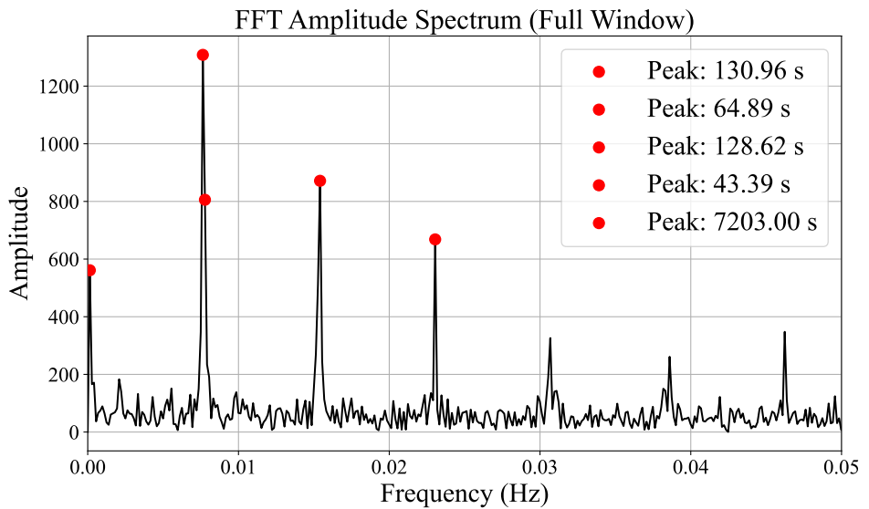
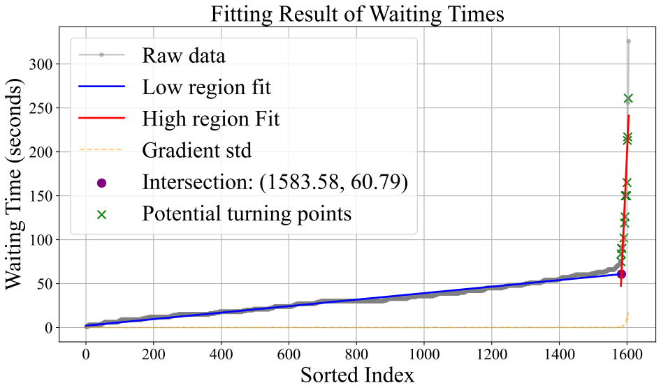
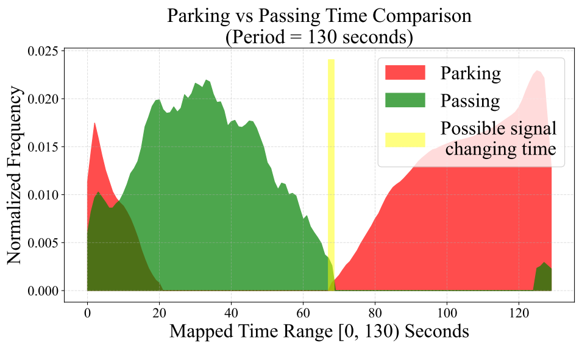

This is the official implementation of Traffic Signal Phase and Timing Estimation with Large-Scale Floating Car Data, which has been accepted by IEEE ITSC 2025.

Environment
Python 3.7

PyTorch 1.11.0

NumPy 1.21.5

Datasets
data: This is a real-world Traffic-Spat dataset collected from a major Chinese map service provider.

OneDrive: https://1drv.ms/f/c/76645c25a8914a0b/EtddyJXYf_xFkhjXTsZj0vIBuraXZcU7fu6fzsJ-7DJWQQ

For access to the full Traffic-Spat dataset, please contact: 1801210364@pku.edu.com

Code
This repository contains the official implementation of Traffic-Spat, including scripts for training, evaluation, and visualization.

Visualization
The following figures illustrate key steps in our signal phase and timing estimation pipeline:

### 1. Signal Period Estimation via FFT  
  
*Using Fast Fourier Transform (FFT) to detect the dominant period of the traffic light cycle.*

### 2. Red Light Prediction via Maximum Waiting Time  
  
*Estimating the start and end of red signals by identifying the peak waiting duration of vehicles.*

### 3. Red-Green Transition Validation  
  
*Verifying predicted signal transitions by aligning multiple days of floating car data.*
